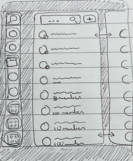
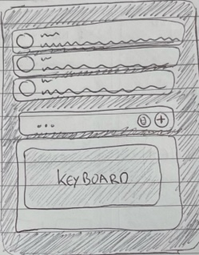
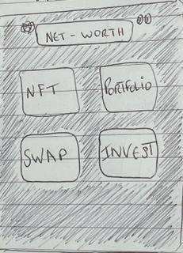
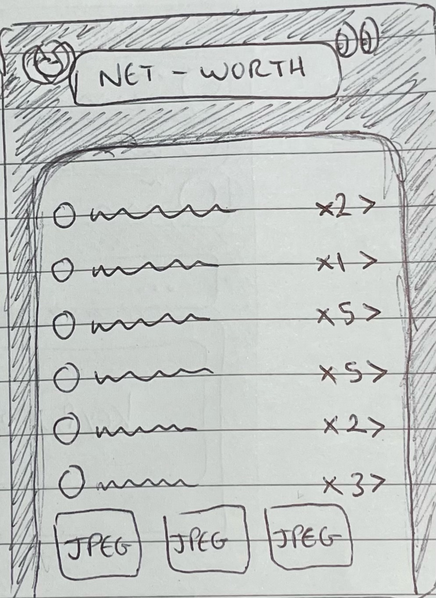
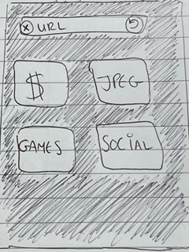

# Wireframes

Here are a few wireframes that I can use to begin the layout; from recent experience I've learnt that following a plan is much easier than making it up as you go along.

## Overview

I'm thinking the main design will have x4 main features:

1. Profile
2. Messaging
3. Wallet
4. Browser

## Profile

## Message

## Wallet

## Browser

